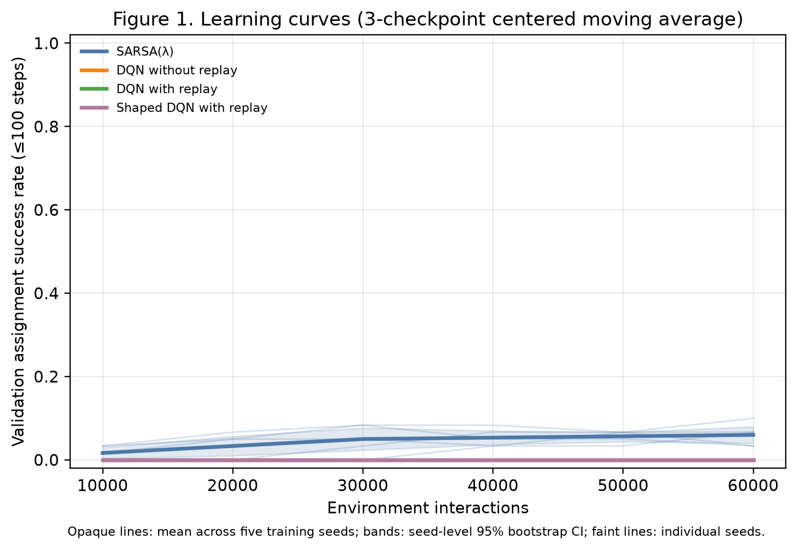
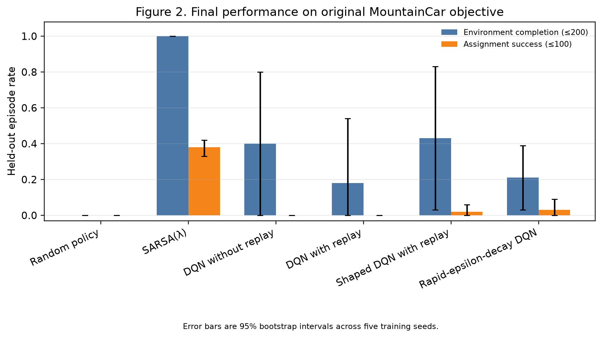
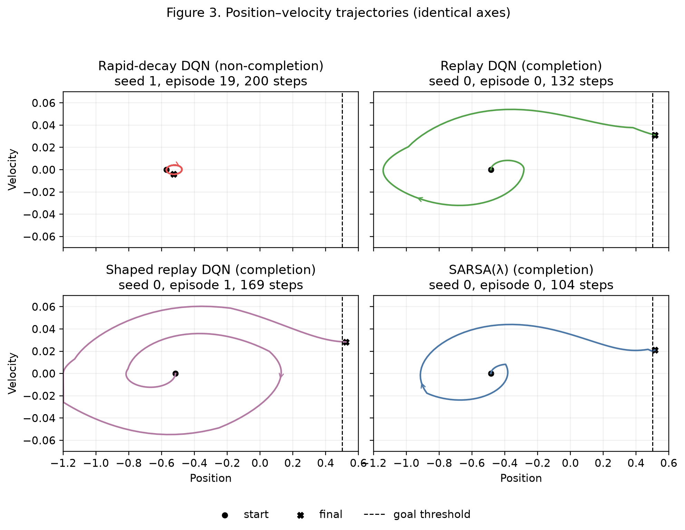
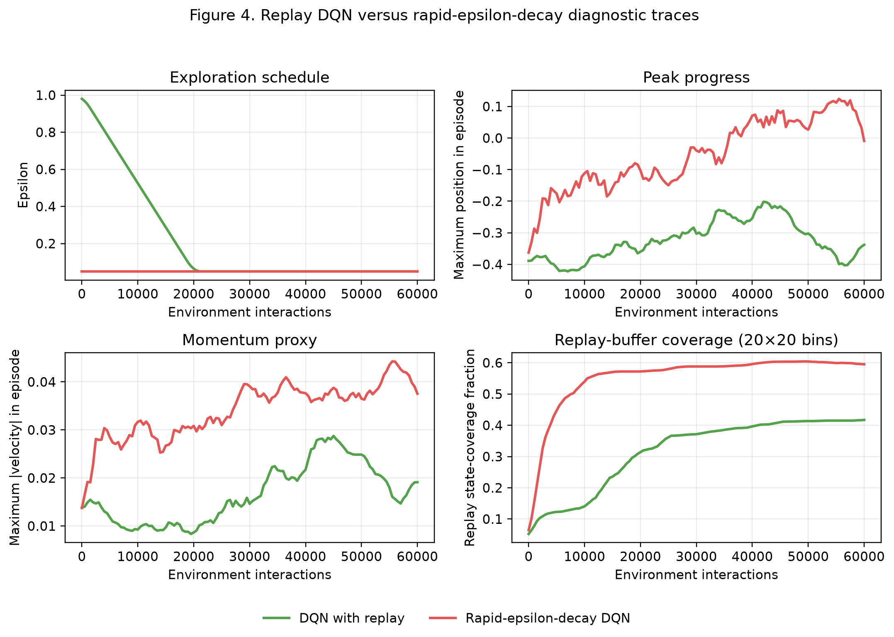

# Learning to Build Momentum: Experience Replay, On-Policy Learning, and Reward Shaping in MountainCar

## Abstract

MountainCar tests whether an agent can learn that reaching a goal to its right
requires first moving away to build momentum. We compared a random policy,
tile-coded SARSA(λ), DQN with and without replay, replay DQN with potential-based
energy-deficit shaping, and a replay DQN with premature exploration decay. Each
learned condition used five fixed training seeds and 60,000 interactions;
validation selected checkpoints before greedy evaluation on 20 held-out seeds
per policy. SARSA(λ) was strongest: it completed every held-out episode and
reached the flag within 100 steps in 0.380 [0.330, 0.420], which was not reliable
satisfaction of the target. Replay did not improve the locked DQN outcome.
Shaped replay recorded occasional discoveries and 0.020 [0.000, 0.060] final
assignment success, but no robust improvement. Rapid decay did not produce the
registered aggregate valley-trapping signature. The principal limitations are
five training seeds, a modest budget, and different function approximators for
SARSA and DQN.

## 1. Problem

`MountainCar-v0` has a two-dimensional continuous state, position (x) and
velocity (v), and three discrete actions: accelerate left, coast, or accelerate
right. An episode normally lasts at most 200 steps. We distinguish environment
completion—reaching the flag within that limit—from the stricter assignment
success criterion of reaching it within 100 steps.

The car's engine is too weak to drive directly up the right hill from the valley.
Always accelerating right therefore settles into an unproductive motion. A
successful controller alternates acceleration with the direction of travel,
climbs one slope, reverses, and converts height into speed. This oscillation
increases the amplitude of successive passes until the car can cross the goal at
(x=0.5). Moving left can thus be useful even though it temporarily increases
distance to the flag.

## 2. Methods

The random policy was a no-learning sanity check. SARSA(λ) represented the
continuous state with 16 overlapping 8 × 8 tile codings and used replacing
eligibility traces. For active tile features, its on-policy update used

\[
\delta_t=r_{t+1}+\gamma Q(s_{t+1},a_{t+1})-Q(s_t,a_t),
\]

with epsilon-greedy behavior, γ = 0.99, λ = 0.9, and the configured learning
rate divided across tilings. True goal termination removed the bootstrap term;
artificial time-limit truncation did not.

All DQN conditions normalized observations from the environment bounds and used
the same two-layer 64-unit ReLU network, Adam optimizer, Huber loss, gradient
clipping, and periodically copied target network. Their target was

\[
y_t=r_t+\gamma(1-\mathbb{1}[\text{terminated}_t])
       \max_a Q_{\mathrm{target}}(s_{t+1},a).
\]

Online DQN updated on the current transition with batch size one. Replay DQN
sampled uniform batches of 64 after a 1,000-transition warm-up from a 50,000-item
buffer. Removing replay therefore also removed minibatch decorrelation and
changed batch size; this is not a memory-only intervention.

The shaped replay condition changed only the training reward. Its interpretable,
dimensionless energy proxy—not exact simulator energy—was

\[
E(x,v)=0.45\sin(3x)+0.55+\eta\,\operatorname{clip}(v/v_{\max},-1,1)^2,
\qquad \Phi(s)=-\operatorname{clip}
\left(\frac{E_{\mathrm{target}}-E(s)}{E_{\mathrm{scale}}},0,1\right),
\]

and the learner received
$r'=r+\beta[\gamma\Phi(s')-\Phi(s)]$, with β = 0.5, η = 0.5, and
$E_{\mathrm{scale}}=0.9$. Squared velocity is direction-neutral, so leftward
momentum is not penalized merely for increasing goal distance. Potential was set
to zero at true termination and retained at time-limit truncation. Final
evaluation always used the original reward.

The deliberate failure condition was valid replay DQN with epsilon decaying from
1.0 to 0.05 over 200 interactions rather than 20,000, placing it near its minimum
before replay warm-up. No code was broken and the condition was not redefined
after seeing its outcome.

## 3. Experimental protocol

Training seeds were fixed at 0–4. Greedy validation used seeds 1000–1019 at
10,000-interaction intervals. After bounded validation and configuration locking,
the selected checkpoint for each run was evaluated on disjoint held-out seeds
2000–2019. Every learned run received exactly 60,000 interactions (300,000 per
condition and 1,500,000 across the five learned conditions); SARSA also recorded
its episode count. The random baseline did not learn.

Checkpoint selection was lexicographic: highest validation assignment-success
rate, highest validation completion rate, lowest median completed length, lowest
episode-length standard deviation, then earliest checkpoint on an exact tie.
Neither configuration nor checkpoint selection used final-test episodes.

Evaluation stopped on `terminated or truncated`, counted actual `env.step` calls,
and was greedy. A 101–200-step completion was never counted as assignment
success. Reported 95% intervals are percentile bootstrap intervals from 10,000
deterministic resamples of the five training-seed summaries. The 20 evaluation
episodes within a policy were not treated as independent training replicates.

## 4. Results

The complete seed-level summary is [Table 1](../results/tables/final_results.md).
Random never completed and returned -200.000 [−200.000, −200.000]. SARSA(λ)
completed 1.000 [1.000, 1.000] of held-out episodes and achieved assignment
success 0.380 [0.330, 0.420], with median completed length 104 steps and mean
original return −100.940 [−102.840, −99.310]. Its across-seed assignment-success
standard deviation was 0.057. This was the strongest measured result, but a 38%
rate does not satisfy a reliability claim.



**Figure 1.** Greedy validation assignment success against interactions. Opaque
lines are five-seed means, bands are seed-level bootstrap intervals, faint lines
are individual seeds, and the three-checkpoint centered moving average is for
display only. Episode-boundary overshoots were linearly aligned to the fixed
10,000-interaction validation grid before smoothing. SARSA shows a small late
increase; no DQN shows sustained within-100 success at this budget.



**Figure 2.** Original-objective held-out completion and assignment success, with
uncertainty across training seeds.

Online DQN completed 0.400 [0.000, 0.800], compared with 0.180 [0.000, 0.540]
for replay DQN; both had zero held-out assignment success. Their median completed
lengths were 151.5 and 132.0 steps. Replay's completion dispersion was lower
(seed SD 0.402 versus 0.548), but its mean completion and original return were
worse: −187.840 versus −177.610. Standard replay observed no training completion
in any seed, while online DQN's median first completion was 31,780 interactions
(observed range 26,516–46,355). Thus the predicted replay advantage in sample
efficiency or stability was not established.

Shaped replay completed 0.430 [0.030, 0.830] and achieved assignment success
0.020 [0.000, 0.060], with median completed length 169 and mean original return
−183.470 [−199.320, −163.210]. Its median observed first training completion was
19,196 interactions (observed range 14,784–23,146), but two of five seeds were
censored. Only one seed recorded a within-100 training success, at 59,161
interactions. Shaping was associated with occasional discovery and did not show
material final-objective harm relative to standard replay, but the sparse events
and broad intervals do not demonstrate reliable acceleration or improvement.

## 5. Behavioral and failure analysis



**Figure 3.** Deterministically selected held-out trajectories on identical axes.
The successful examples were closest to each condition's pooled median completed
length; “completion” here does not imply the 100-step target. The rapid-decay
non-completion was closest to the failed-episode median maximum position.

Replay DQN, shaped replay DQN, and SARSA trace expanding loops in position–velocity
space. Each reversal permits a wider subsequent swing and ultimately a crossing
of the goal threshold. The shown rapid-decay episode instead makes a tiny loop
near its start and ends after 200 steps, illustrating one way a nearly greedy
policy can fail to accumulate momentum.



**Figure 4.** Five-seed training diagnostics for standard and rapid-decay replay
DQN. Curves are interpolated to a 500-interaction grid and use a five-point
centered display smoother.

The aggregate evidence contradicts a simple valley-trapping account. Rapid
decay reaches minimum epsilon almost immediately, yet it shows broader replay
state coverage, larger peak position, and greater maximum absolute velocity than
standard replay through much of training. It also obtained 0.030 [0.000, 0.090]
held-out assignment success and 0.210 [0.030, 0.390] completion. Consequently,
the preregistered hypothesis that premature exploitation systematically prevents
momentum discovery is not supported. The selected failure trajectory is real but
not representative evidence for a condition-wide mechanism. Possible alternative
explanations include unstable value optimization, seed-dependent action
preferences, weak checkpoint transfer to held-out starts, or simply insufficient
interaction budget; these diagnostics do not distinguish among them.

## 6. Limitations

Five training seeds permit only coarse uncertainty estimates, especially for
rare successes. MountainCar is a small deterministic benchmark, so conclusions
may not transfer to noisy, high-dimensional tasks. Tuning was intentionally
bounded and the 60,000-interaction budget was practical rather than exhaustive.
SARSA and DQN differ in tile-coded versus neural approximation, eligibility
traces, optimization, and policy regime; their difference is not a controlled
on-policy/off-policy effect. The replay ablation is more controlled, but also
changes batch size and temporal correlation. Finally, the shaping quantity is an
approximate energy proxy rather than exact mechanical energy, and potential-based
theory does not guarantee equal finite-training behavior with function
approximation and checkpoint selection.

## 7. Conclusion

No condition reliably met the ≤100-step assignment target. SARSA(λ) was the
clearest learner at this budget, completing every held-out episode but meeting
the strict target only 38% of the time. Replay did not improve this DQN
implementation over online updates on the measured endpoints. Energy-deficit
shaping was associated with occasional earlier completion and a small nonzero
final success rate, but not robust benefit. The planned rapid-decay failure did
not exhibit its predicted aggregate mechanism. The narrow empirical lesson is
that successful policies used oscillatory momentum-building trajectories, while
neither replay, shaping, nor an intuitive exploration story earned a general
causal claim from these five-seed results.

## 8. Reproducibility

Run from the repository root with Python 3.12:

```bash
# Install the locked environment.
uv sync --frozen --python 3.12 --extra dev

# Run tests and all short smoke conditions.
bash scripts/smoke_test.sh

# Reproduce all locked training runs (expensive).
bash scripts/run_full_experiments.sh

# Evaluate existing locked checkpoints on the frozen held-out seeds.
uv run --python 3.12 mountaincar-run-suite \
  --evaluate-only --output results/processed/final_manifest.json

# Regenerate the validated table and four figures without training/evaluation.
uv run --python 3.12 python -m mountaincar_rl.analysis.make_all_figures
```

Raw metrics, configuration snapshots, and evaluation trajectories are under
`results/raw/full/`; locked configuration hashes are in
`configs/full/locked_manifest.yaml`.
